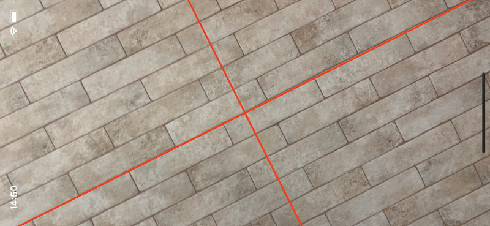

# Laser Level

A simple iOS app to simulate a laser level using built-in camera and gyroscope.

## Demo
https://youtu.be/aB03EtQ5zsU

## Usage
* Download folder
* Open .xcodeproj file in Xcode
* Run on your device (no simulator supported !)
* Drag to move lines over the X or Y axis accordingly
* Tap any place to reset lines at center

### Credits
* App icon
<a href="https://www.flaticon.com/free-icons/laser-level" title="laser level icons">Laser level icons created by Freepik - Flaticon</a>
